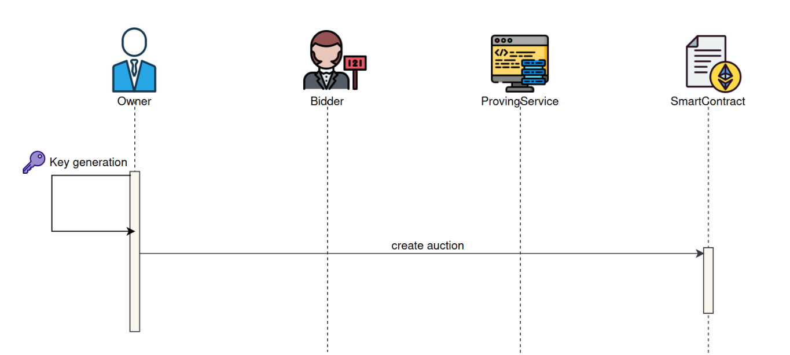
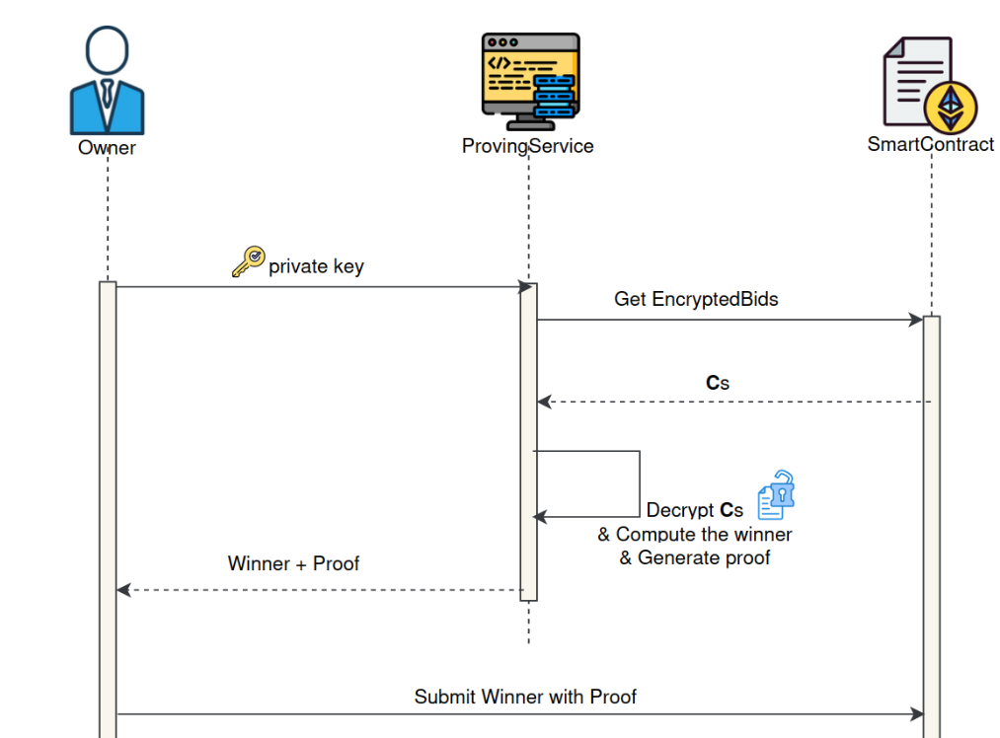
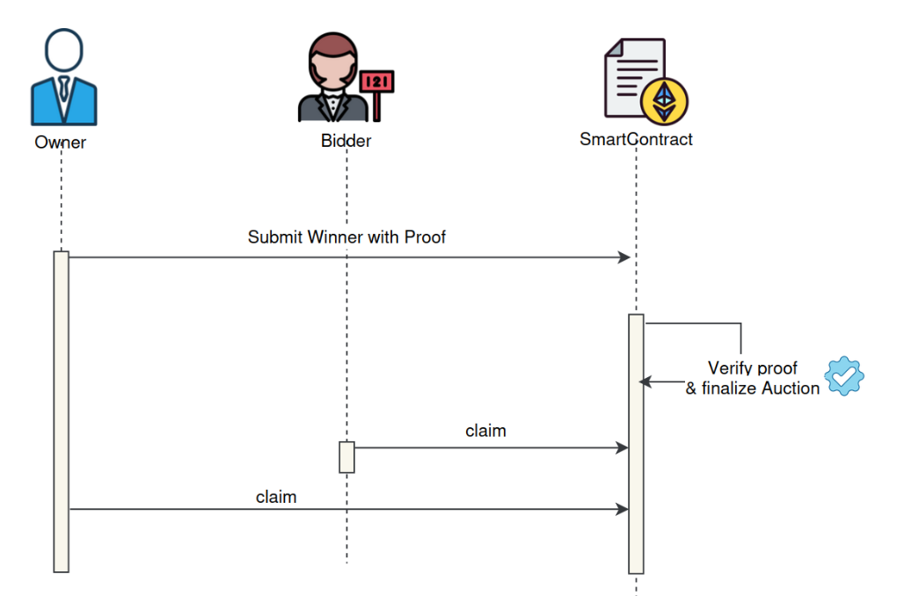
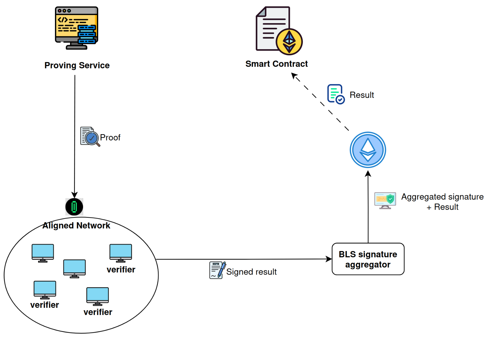

# TAHM-KENCH

[](./LICENSE)

## Introduction

**Tahm-Kench** is a [**Sealed-Bid Auction**](https://www.investopedia.com/terms/s/sealed-bid-auction.asp) platform built
using [**SP1 zkVM**](https://docs.succinct.xyz/getting-started/install.html) and [**Aligned**](https://docs.alignedlayer.com/).
The project aims to facilitate secure and private auctions by leveraging **zero-knowledge proofs (ZKPs)** to determine
the highest bidder without revealing individual bid amounts. This ensures both privacy and fairness in the bidding
process.

Additionally, **Tahm-Kench** serves as a **reference model** for developers interested in building decentralized applications (dApps)
using **Aligned** and **ZKPs**.

## Team :busts_in_silhouette:

- **Team Members:** Part of [SotaZK Labs](https://sotazk.org/), a team dedicated to pioneering zero-knowledge solutions that enhance
  security and privacy in the decentralized world.
- **Number of Members:** 7
- **Contact Information:**
    - **Name:** Steve Nguyen
    - **Email:** zk.steve.nguyen@gmail.com
    - **Telegram:** @zk_steve
- **Prior Work/Research:**
    - [ZKP Documentation](https://github.com/sota-zk-labs/zkp-documents): A repository exploring ZKP technologies such as KZG, GKR,
      FRI, Plonk, DARK, Groth16, lattice-based commitment schemes, sum-check protocols, Nova, EIP-4844, and more.
    - [ZKP Implementation](https://github.com/sota-zk-labs/zkp-implementation): Implementations of ZKP protocols, including KZG, FRI,
      and Plonk.
    - [Apstark](https://github.com/sota-zk-labs/apstark): A Layer-2 ZK rollup blockchain built on the Aptos network using the Starknet
      tech stack.

## Overview

### Core Idea

Bidders submit encrypted bids to a smart contract, which only the auction owner can decrypt using their secret key. At the conclusion
of the auction, the owner publishes the winner. **ZKPs** ensure the auction owner processes all bids and selects the highest one
without revealing their private key or any bid details.

Key components of the project include:

- **Proving Service:** Powered by **SP1**, this service generates a **zero-knowledge proof** from the execution trace of a program that
  decrypts bids and computes the winner, ensuring the confidentiality of bid amounts and the owner's private key.
- **Smart Contract:** Manages the auction lifecycle (setup, bidding, and settlement) and verifies the ZK proof.

### Technology Stack

- **Smart Contract:** Solidity
- **Circuit:** Rust, SP1
- **Encryption Scheme:** secp256k1, AES-256-GCM, HKDF-SHA256
- **Verifier:** Aligned Layer

### Workflow

Watch our workflow demo video [here](https://www.youtube.com/watch?v=uM8o2fUbVP0).

**Tahm-Kench's** core logic operates on-chain, while off-chain processes handle winner calculation and proof generation. The auction
process has four main phases:

1. **Initial Setup:** The auction owner creates the auction, sets a deposit amount, transfers assets to the smart contract, and defines
   the start and end times.
2. **Bidding Phase:** Bidders submit encrypted bids and deposit the required amount.
3. **Opening Phase:** After the bidding window closes, the auction owner calculates the winner and generates the corresponding ZKP.
4. **Verification Phase:** The winner and proof are submitted to the smart contract for verification, concluding the auction.

#### Sequence Diagrams:

1. **Initial Setup:**
   
2. **Bidding Phase:**
   
3. **Opening Phase:**
   
4. **Verification Phase:**
   

#### Verification Inner Flow:



### Challenges

We initially used the [ecies](https://crates.io/crates/ecies) crate to encrypt and decrypt bids. However, proving time and proof size
were problematic: **6 minutes** to generate a proof for **2 bids**, resulting in a **21MB** proof size on a system with **64GB RAM**
and an **i5-13500 CPU**. This large proof size was incompatible with the Aligned layer, requiring compression and thus further
increasing
proving time.

To improve performance, we rebuilt the encryption scheme using SP1's patched `secp256k1` crate. This reduced proving time to **1 minute
** and proof size to **1.5MB**. However, verification on SP1 failed due to the error
`Core(Invalid shard proof: Out-of-domain evaluation mismatch on chip CPU)`. The code is available in
the [feat/ecies](https://github.com/sota-zk-labs/tahm-kench/tree/943c7db048af6acd63b63701eddae6872f404030) branch.

### Benchmarking

We compared performance of the original and patched `secp256k1` crates on a **Core i5-13500 CPU** with **64GB RAM**.

#### Original secp256k1 Crate

Uses sp1-sdk [v1.0.1](https://github.com/succinctlabs/sp1/tree/v1.0.1), compatible with Aligned verification.

| **Number of Bidders: 10** | **Compressed Mode** | **Uncompressed Mode** |
|---------------------------|---------------------|-----------------------|
| Proof Generation Time     | >30 mins            | ~15 mins              |
| Proof Size                | 15MB                | 50MB                  |

#### Patched secp256k1 Crate

Uses sp1-sdk [v3.0.0](https://github.com/succinctlabs/sp1/tree/v1.0.1), optimized for off-chain proof verification but incompatible
with Aligned verification. Code
available [here](https://github.com/sota-zk-labs/tahm-kench/tree/6246001018aa61afbc8212757d774fa7780218fe).

| **Number of Bidders: 10** | **Compressed Mode** | **Uncompressed Mode** |
|---------------------------|---------------------|-----------------------|
| Proof Generation Time     | 7 mins              | 2.5 mins              |
| Proof Size                | 1.2MB               | 16MB                  |

### Future Plans

Future developments include optimizing performance of the prover, introducing auction types like **Unique Lowest Bid Auctions** and *
*Dutch Auctions**, and exploring partnerships with other **dApps**, such as **DeFi platforms**, for automated asset management based on
auction results.

## Execution Instructions

### Requirements

- [Rust](https://www.rust-lang.org/tools/install)
- [Foundry](https://getfoundry.sh)
- [Aligned CLI](https://docs.alignedlayer.com/introduction/1_try_aligned)
- [SP1](https://docs.succinct.xyz/getting-started/install.html)

### Setup

1. **Create a Local Keystore**

First, create a local keystore using the `cast` tool. If you already have one, you can skip this step.

```bash
cast wallet import --private-key <YOUR_PRIVATE_KEY> <WALLET_NAME>
# Example: cast wallet import --private-key 0x... wallet
```

2. **Clone the Repository**

Clone our repository and navigate to the project directory:

```bash
git clone https://github.com/sota-zk-labs/tahm-kench
cd tahm-kench
```

3. **Run Commands as the Owner (if applicable)**

If you are the owner, execute the following commands:

```bash
# Deposit $AMOUNT ETH to Aligned layer to verify the proof
make deposit-to-aligned KEYSTORE_PATH=<KEYSTORE_PATH> AMOUNT=<AMOUNT>
# Example: make deposit-to-aligned KEYSTORE_PATH=~/.foundry/keystores/wallet AMOUNT=0.001

# Generate a public-private key pair
cd crates/sp1-prover && make gen-key
```

After this, you should find the `elf` folder, `encryption_key` and `private_encryption_key` in the `sp1-prover`
directory.

4. **Install the CLI**

Finally, install the CLI from our source:

```bash
make install
```

### Usage

To view all available commands, run:

```bash
tahken -h
```

### Demo

You can watch our demo video [here](https://www.youtube.com/watch?v=zd2pueMMGkQ).
