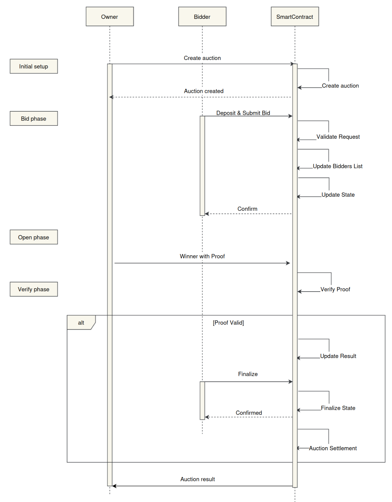
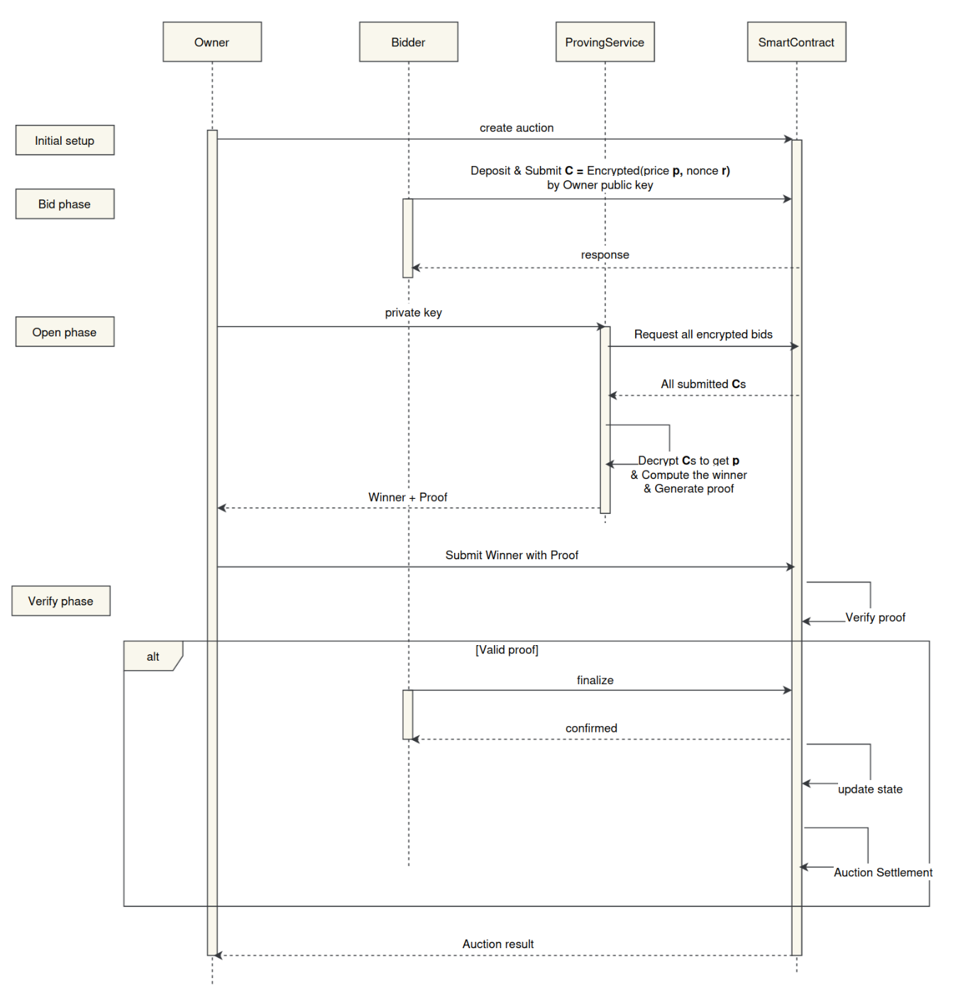

# TAHM-KENCH

[](./LICENSE)

## Introduction

**Tahm-Kench** is a [**Sealed-Bid Auction**](https://www.investopedia.com/terms/s/sealed-bid-auction.asp) platform built
using [**SP1 zkVM**](https://docs.succinct.xyz/getting-started/install.html) and [**Aligned**](https://docs.alignedlayer.com/).
The project aims to facilitate secure and private auctions by leveraging **zero-knowledge proofs (ZKPs)** to determine
the highest bidder without revealing individual bid amounts. This ensures both privacy and fairness in the bidding
process.

Additionally, **Tahm-Kench** serves as a **reference model** for developers interested in building decentralized
applications (dApps) using **Aligned** and **ZKPs**.

## Team :busts_in_silhouette:

- **Team Members:** We are part of [SotaZK Labs](https://sotazk.org/), a team focused on pioneering zero-knowledge
  solutions to enhance
  security and privacy in the decentralized world.
- **Number of Members**: 7
- **Contact Information:**
    - **Name:** Steve Nguyen
    - **Email:** zk.steve.nguyen@gmail.com
    - **Telegram:** @zk_steve
- **Prior Work/Research (Optional):**
    - [ZKP Documentation](https://github.com/sota-zk-labs/zkp-documents): A repository dedicated to demystifying
      zero-knowledge proof
      technology, including KZG, GKR, FRI, Plonk, DARK, Groth16, lattice-based commitment schemes, sum-check protocol,
      Nova, EIP-4844, etc.
    - [ZKP Implementation](https://github.com/sota-zk-labs/zkp-implementation): Various ZKP protocols, including KZG,
      FRI, and Plonk.
    - [Apstark](https://github.com/sota-zk-labs/apstark): A layer 2 ZK rollup blockchain built on the Aptos network
      using the Starknet
      tech stack.

## Overview

### Core idea

Bidders submit encrypted bids to a smart contract, which only the auction owner can decrypt using their secret key. At
the conclusion
of the auction, the owner publishes the winner. **ZKPs** ensure that the auction owner reads all bids and selects the
highest one
without revealing their private key or any bid details.

Key components of the project include:

- **Proving Service**: Powered by **SP1**, this service generates a **zero-knowledge proof** from the execution trace of
  a program that decrypts bids and computes the winner, while preserving the confidentiality of individual bid amounts
  and the owner's private key.
- **Smart Contract**: The smart contract verifies the ZK proof and manages the entire auction lifecycle, including
  setup, bidding, and settlement.

### Technology Stack

- **Smart Contract**: Solidity
- **Circuit**: Rust, SP1
- **Encryption scheme**: secp256k1, AES-256-GCM, HKDF-SHA256
- **Verifier**: Aligned layer

### Workflow

You can view our workflow demo video [here](https://www.youtube.com/watch?v=uM8o2fUbVP0).

The core logic of **Tahm-Kech** operates on-chain, while off-chain processes handle the winner calculation and proof
generation. The auction process follows four main phases:

1. **Initial Setup**: The auction owner creates the auction, sets the required deposit amount, transfers assets to the
   smart contract,
   and defines the auction's start and end times.
2. **Bid Phase**: Bidders submit their bids to the smart contract by depositing the required amount.
3. **Open Phase**: After the bidding window closes, the auction owner calculates the winner and generates a
   zero-knowledge proof.
4. **Verify Phase**: The owner submits the winner and the proof to the smart contract for verification, concluding the
   auction.

**Sequence diagrams for each module are shown below:**

#### Auction Flow:



#### Prover & Verifier Flow:



### Challenges

We used the [ecies](https://crates.io/crates/ecies) crate to encrypt and decrypt bids. However, the proving time and
proof size were substantial:it took **6 minutes** to generate a proof for **2 bids**, resulting in a **21MB** proof size
on a system with **64GB RAM** and an **i5-13500 CPU**. This large proof size couldn't be submitted to the Aligned
layer, so we compressed it, which further increased the proving time.

To address this, we rebuilt the encryption scheme using SP1's patched `secp256k1` crate. This reduced the proving time
to **1 minute** and compressed the proof size to **1.5MB**. However, the proof couldn't be verified by SP1 due to the
error `Core(Invalid shard proof: Out-of-domain evaluation mismatch on chip CPU)`. You can review the code in
the [feat/ecies](https://github.com/sota-zk-labs/tahm-kench/tree/feat/ecies) branch.

### Future Plans

Due to SP1's performance limitations, we plan to use `Gnark` as the tool to build a custom circuit optimized for our
existing encryption scheme. Following this development, we aim to introduce additional auction types, such as **Unique
Lowest Bid Auctions** and **Dutch Auctions**. We also plan to explore collaborations with other **dApps**, including
**DeFi platforms**, to facilitate automatic asset management based on auction outcomes.

## Execution instructions

### Requirements

Ensure you have the following installed:

1. [Rust](https://www.rust-lang.org/tools/install)
2. [Foundry](https://getfoundry.sh)
3. [Aligned CLI](https://docs.alignedlayer.com/introduction/1_try_aligned)
4. [SP1](https://docs.succinct.xyz/getting-started/install.html)

### Setup

1. **Create a Local Keystore**

First, create a local keystore using the `cast` tool. If you already have one, you can skip this step.

```bash
cast wallet import --private-key <YOUR_PRIVATE_KEY> <WALLET_NAME>
# Example: cast wallet import --private-key 0x... wallet
```

2. **Clone the Repository**

Clone our repository and navigate to the project directory:

```bash
git clone https://github.com/sota-zk-labs/tahm-kench
cd tahm-kench
```

3. **Run Commands as the Owner (if applicable)**

If you are the owner, execute the following commands:

```bash
# Deposit $AMOUNT ETH to Aligned layer to verify the proof
make deposit-to-aligned KEYSTORE_PATH=<KEYSTORE_PATH> AMOUNT=<AMOUNT>
# Example: make deposit-to-aligned KEYSTORE_PATH=~/.foundry/keystores/wallet AMOUNT=0.001

# Generate a public-private key pair
cd crates/sp1-prover && make gen-key
```

After this, you should find the `elf` folder, `encryption_key` and `private_encryption_key` in the `sp1-prover`
directory.

4. **Install the CLI**

Finally, install the CLI from our source:

```bash
make install
```

### Usage

To view all available commands, run:

```bash
tahken -h
```

### Demo

You can watch our demo video [here](https://www.youtube.com/watch?v=zd2pueMMGkQ).

## Project roadmap